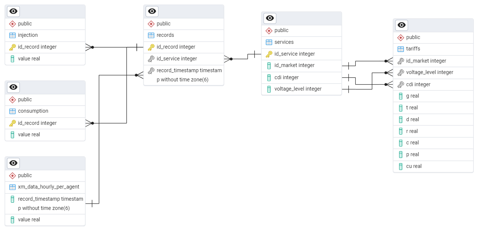
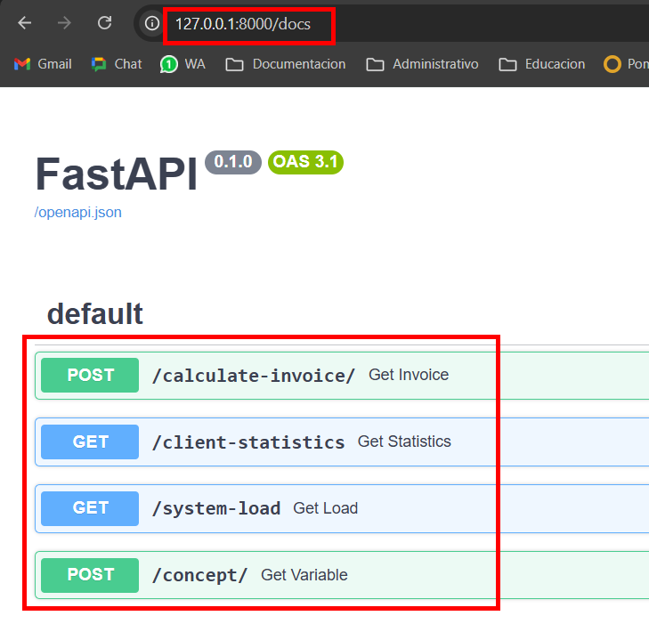

# Invoice System

Sistema de cálculo y análisis de facturación de energía utilizando **Python**, **FastAPI** y **PostgreSQL**, capaz de manejar cálculos complejos, grandes volúmenes de datos y optimizaciones avanzadas.

## Resultados para registros de  la prueba

### Servicio 3222
```json
[
  {
    "id_service": 3222,
    "id_market": 4,
    "cdi": 101,
    "voltage_level": 2,
    "total_consumption": 29768.62,
    "total_injection": 344.86,
    "cu": 584.17,
    "c": 23.58,
    "ea": 17389934.75,
    "ec": 8131.8,
    "ee1": -201456.87,
    "ee2": 0
  }
]
```

### Servicio 2478
```json
[
  {
    "id_service": 2478,
    "id_market": 1,
    "cdi": 0,
    "voltage_level": 1,
    "total_consumption": 562.97,
    "total_injection": 727.88,
    "cu": 711.62,
    "c": 23.94,
    "ea": 400620.71,
    "ec": 17425.45,
    "ee1": -400620.71,
    "ee2": 705515.49
  }
]
```

### Servicio 2256
```json
[
  {
    "id_service": 2256,
    "id_market": 1,
    "cdi": 100,
    "voltage_level": 1,
    "total_consumption": 381.77,
    "total_injection": 594.97,
    "cu": 770.73,
    "c": 23.94,
    "ea": 294241.59,
    "ec": 14243.58,
    "ee1": -294241.59,
    "ee2": 600452.21
  }
]
```

## Explicacion Calculos

### EE1:


EE1 = min(∑Inyeccion, ∑Consumo)


ValorEE1 = EE1 × CUnegativo​


Procedimiento para el Cálculo de EE1:

Explicacion de Comparación de Energías:
```
Caso 1: Si la sumatoria de la energía inyectada (injection) es menor o igual que la sumatoria de la energía consumida (consumption), la cantidad de EE1 es igual a la sumatoria de la energía inyectada.
```
```
Caso 2: Si la sumatoria de la energía inyectada es mayor que la sumatoria de la energía consumida, la cantidad de EE1 es igual a la sumatoria de la energía consumida.
```
```
Tarifa Aplicable:

En ambos casos, la tarifa aplicada a los excedentes de energía es el Costo Unitario (CU) negativo definido en las tarifas correspondientes.
```


## Características
- API RESTful con FastAPI.
- Base de datos PostgreSQL.


## Estructura del Proyecto

```
backend/
│── venv/              # Entorno virtual
│── assets/            # Carpeta recursos
│── app/
│   ├── main.py        # Punto de entrada de la aplicación
│   ├── api/
│   │   ├── routes.py  # Rutas de la API
│   ├── models/
│   │   ├── schemas.py # Esquemas de datos
│   ├── services/
│   │   ├── invoice.py # Lógica de facturación
│   ├── db/
│   │   ├── connection.py  # Conexión a la BD
│   │   ├── queries.py     # Consultas SQL
│── requirements.txt   # Dependencias
│── .gitignore         # Archivos ignorados por Git
```

## Base de datos

### 1. Crear base de datos
```sql
CREATE DATABASE billing_system
    WITH
    OWNER = postgres
    ENCODING = 'UTF8'
    LC_COLLATE = 'es-ES'
    LC_CTYPE = 'es-ES'
    LOCALE_PROVIDER = 'libc'
    TABLESPACE = pg_default
    CONNECTION LIMIT = -1
    IS_TEMPLATE = False;
```

### 2. Crear tablas

```sql
CREATE TABLE records (
    id_record INTEGER PRIMARY KEY,     
    id_service INTEGER NOT NULL,
    record_timestamp TIMESTAMP(6) NOT NULL
);

CREATE TABLE services (
    id_service INTEGER PRIMARY KEY,     
    id_market INTEGER NOT NULL,
    cdi INTEGER NOT NULL,
	voltage_level INTEGER NOT NULL
);

CREATE TABLE injection (
    id_record INTEGER PRIMARY KEY,     
    value REAL NOT NULL
);

CREATE TABLE consumption (
    id_record INTEGER PRIMARY KEY,     
    value REAL NOT NULL
);

CREATE TABLE xm_data_hourly_per_agent (     
    record_timestamp TIMESTAMP(6) NOT NULL,
	value REAL NOT NULL
	
);

CREATE TABLE tariffs (
	id_market INTEGER NOT NULL,
	voltage_level INTEGER NOT NULL,
	cdi INTEGER,
	G REAL NOT NULL,
	T REAL NOT NULL,
	D REAL NOT NULL,
	R REAL NOT NULL,
	C REAL NOT NULL,
	P REAL NOT NULL,
	CU REAL NOT NULL
);

```

### 3. Relacionar tablas
```sql
ALTER TABLE injection
ADD CONSTRAINT fk_injection_id_record
FOREIGN KEY (id_record) REFERENCES records(id_record);

ALTER TABLE records
ADD CONSTRAINT fk_records_id_service
FOREIGN KEY (id_service) REFERENCES services(id_service);

ALTER TABLE records
ADD CONSTRAINT fk_records_record_timestamp
FOREIGN KEY (record_timestamp) REFERENCES xm_data_hourly_per_agent(record_timestamp);

ALTER TABLE consumption
ADD CONSTRAINT fk_consumption_id_record
FOREIGN KEY (id_record) REFERENCES consumption(id_record);

ALTER TABLE tariffs
ADD CONSTRAINT fk_tariffs_id_market
FOREIGN KEY (id_market) REFERENCES services(id_market);

ALTER TABLE tariffs
ADD CONSTRAINT fk_tariffs_cdi
FOREIGN KEY (cdi) REFERENCES services(cdi);

ALTER TABLE tariffs
ADD CONSTRAINT fk_tariffs_voltage_level
FOREIGN KEY (voltage_level) REFERENCES services(voltage_level);
```

### 4. Diagrama Entidad Relación (ERD)



## Instalación y Configuración del proyecto

### 1. Clonar el repositorio
```bash
git clone https://github.com/Qyabro/invoice_system
cd backend
```

### 2. Crear y activar el entorno virtual
```bash
python -m venv venv
source venv/bin/activate  # En Windows: venv\Scripts\activate
```

### 3. Instalar dependencias
```bash
pip install -r requirements.txt
```

### 4. Configurar PostgreSQL
Asegúrate de tener PostgreSQL instalado y configurado. 
Edita `app/db/connection.py` con tus credenciales de base de datos.

### 5. Ejecutar la aplicación
```bash
uvicorn app.main:app --reload
```

## Endpoints

| Método | Ruta                |          Descripción               |
|---------|--------------------|------------------------------------|
| POST    | /calculate-invoice | Calcula factura por cliente                   |
| GET     | /client-statistics | Estadisticas del cliente           |
| GET     | /system-load       | Carga del sistema por hora         |
| POST    | /concept           | Calculo independiente de conceptos |

### Probar endpoints desde FastAPI /docs

Se puede aprovechar el **/docs** de FastAPI que se genera al ejecutar el proyecto, para probar los endpoins: [http://127.0.0.1:8000/docs](http://127.0.0.1:8000/docs)



### POST /calculate-invoice

#### Example:
```bash
http://127.0.0.1:8000/calculate-invoice/
```
Request Body:
```json
{
  "client_id": 3222,
  "year": 2023,
  "month": 9
}
```
Response body:
```json
[
  {
    "id_service": 3222,
    "id_market": 4,
    "cdi": 101,
    "voltage_level": 2,
    "total_consumption": 29768.384765625,
    "total_injection": 344.8620300292969,
    "cu": 584.1699829101562,
    "c": 23.579999923706055,
    "ea": 17389796,
    "ec": 8131.8466796875,
    "ee1": -201458.046875,
    "ee2": 0
  }
]
```

### GET /client-statistics
```bash
http://127.0.0.1:8000/client-statistics?client_id=3222&year=2023&month=9
```
Response body:
```json
[
  {
    "id_service": 3222,
    "total_consumption": 29768.384765625,
    "total_injection": 344.8620300292969,
    "avg_hourly_consumption": 41.34497884114583,
    "avg_hourly_injection": 0.4789750417073568,
    "net_balance": -29423.5234375
  }
]
```
### GET /system-load

```bash
http://127.0.0.1:8000/system-load?year=2023&month=9&day=14
```
Response body:
```json
[
  {
    "date": "2023-09-14T00:00:00",
    "total_load_kwh": 53.4890022277832
  },
  {
    "date": "2023-09-14T01:00:00",
    "total_load_kwh": 57.290000915527344
  },
  {
    "date": "2023-09-14T02:00:00",
    "total_load_kwh": 47.39899826049805
  },
  ...
  ...
  ...
]
```

### POST /concept

```bash
http://127.0.0.1:8000/concept/
```

#### - EA
Para el calculo de **EA**, se debe enviar la opcion **1**.

Request Body:
```json
{
  "client_id": 3222,
  "year": 2023,
  "month": 9,
  "option": 1
}
```

Response body:
```json
[
  {
    "id_service": 3222,
    "id_market": 4,
    "cdi": 101,
    "voltage_level": 2,
    "total_consumption": 29768.384765625,
    "cu": 584.1699829101562,
    "ea": 17389796
  }
]
```

#### - EC
Para el calculo de **EC**, se debe enviar la opcion **2**.

Request Body:
```json
{
  "client_id": 3222,
  "year": 2023,
  "month": 9,
  "option": 2
}
```

Response body:
```json
[
  {
    "id_service": 3222,
    "id_market": 4,
    "cdi": 101,
    "voltage_level": 2,
    "total_injection": 344.8620300292969,
    "c": 23.579999923706055,
    "ec": 8131.8466796875
  }
]
```

#### - EE1
Para el calculo de **EE1**, se debe enviar la opcion **3**.

Request Body:
```json
{
  "client_id": 3222,
  "year": 2023,
  "month": 9,
  "option": 3
}
```

Response body:
```json
[
  {
    "id_service": 3222,
    "total_injection": 344.8620300292969,
    "total_consumption": 29768.384765625,
    "cu": 584.1699829101562,
    "ee1": -201458.046875
  }
]
```

#### - EE2
Para el calculo de **EE2**, se debe enviar la opcion **4**.

Request Body:
```json
{
  "client_id": 3222,
  "year": 2023,
  "month": 9,
  "option": 4
}
```

Response body:
```json
[
  {
    "id_service": 3222,
    "ee2": 0
  }
]
```
